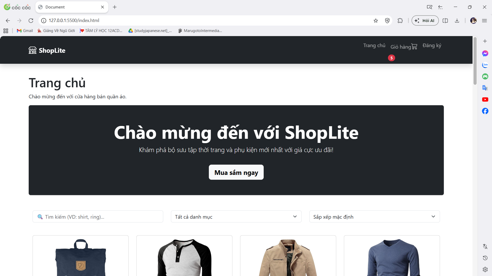
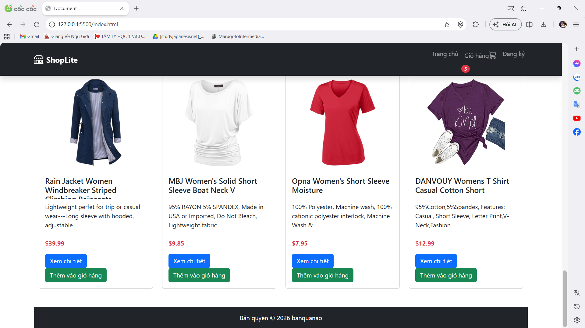
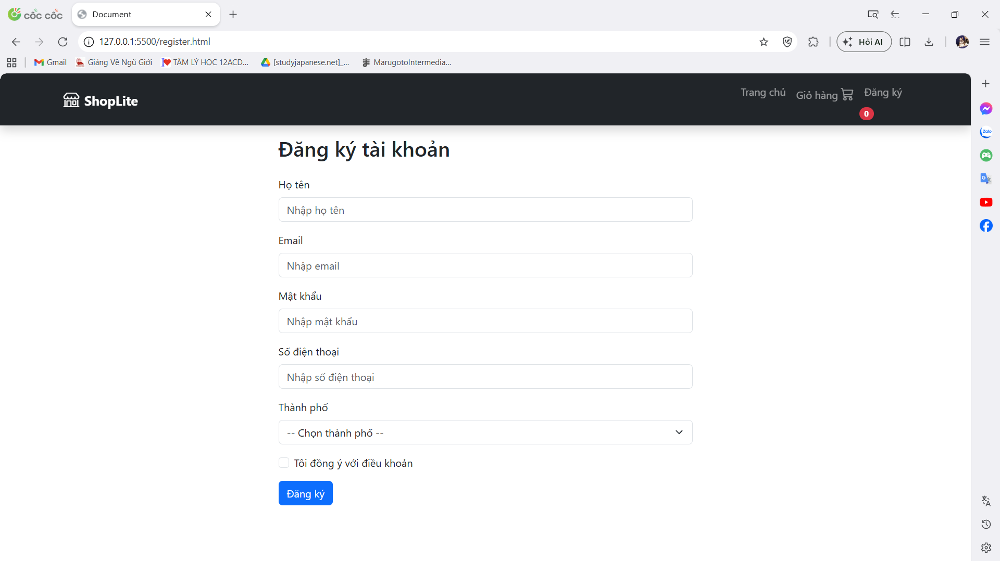
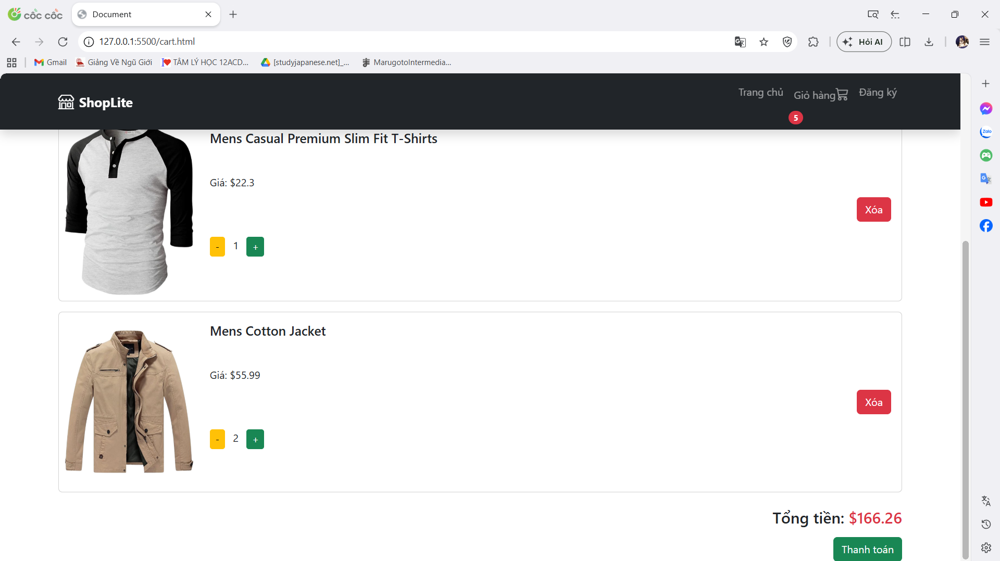
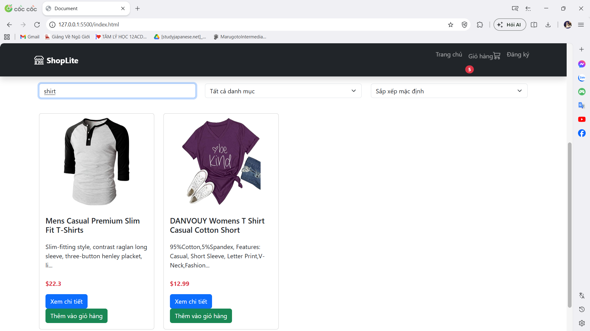
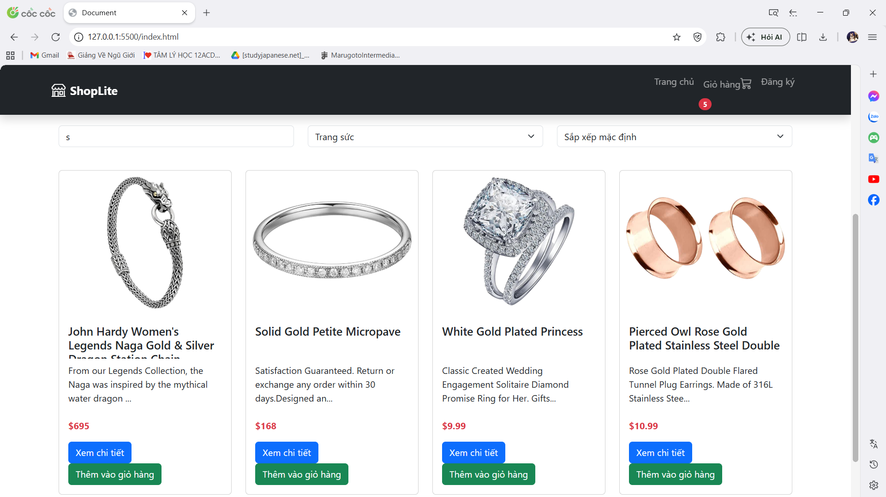
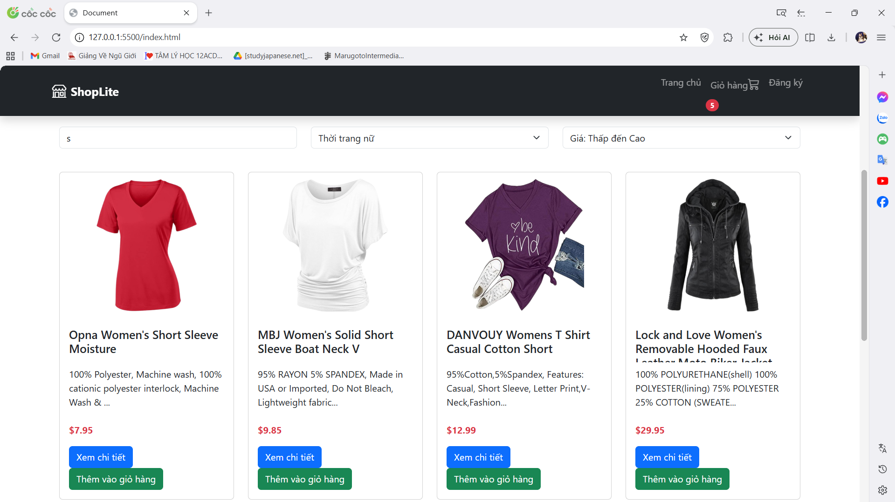

# ShopLite - Mini E-Commerce Project

**Link Demo:** https://klinh160.github.io/fef-shoplite-linhntk47/

## 1. Mô tả dự án
ShopLite là một ứng dụng web mua sắm trực tuyến đa trang được xây dựng bằng HTML, CSS (Bootstrap 5) và Vanilla JavaScript. 
Dự án sử dụng Fake Store API để lấy dữ liệu sản phẩm, cho phép người dùng xem sản phẩm, tìm kiếm, lọc, và quản lý giỏ hàng trực tiếp trên trình duyệt (sử dụng localStorage) mà không cần đến backend.

## 2. Danh sách tính năng đã hoàn thiện
Dựa theo barem yêu cầu của bài tập, dự án đã hoàn thiện các tính năng sau:

*   **Tính năng cốt lõi:**
    *   Xây dựng đủ 4 trang (Home, Product, Cart, Register) với Navbar chung.
    *   Sử dụng cấu trúc HTML Semantic và Responsive cơ bản trên điện thoại/máy tính.
    *   Fetch dữ liệu từ API và render giao diện động bằng DOM.
    *   Trang chi tiết hiển thị đúng thông tin một sản phẩm theo ID.
    *   Form đăng ký có kiểm tra lỗi đầy đủ bằng JavaScript.
*   **Tính năng bổ sung:**
    *   Chức năng Giỏ hàng: Thêm, xóa, thay đổi số lượng, tính tổng tiền và lưu `localStorage`.
    *   Tìm kiếm chữ và lọc sản phẩm theo danh mục.
    *   Có trạng thái Loading khi chờ lấy dữ liệu và hiển thị lỗi nếu mất mạng.
*   **Tính năng nâng cao:**
    *   Kết hợp sắp xếp giá tiền cùng lúc với tìm kiếm và lọc.
    *   Hiển thị số lượng trên biểu tượng Giỏ hàng nảy số đồng bộ.

## 3. Hướng dẫn chạy dự án
1. Tải mã nguồn về máy tính.
2. Mở thư mục dự án bằng Visual Studio Code.
3. Cài đặt tiện ích Live Server
4. Chuột phải vào file `index.html` và chọn "Open with Live Server" để chạy thử.

## 4. Ảnh chụp màn hình giao diện

